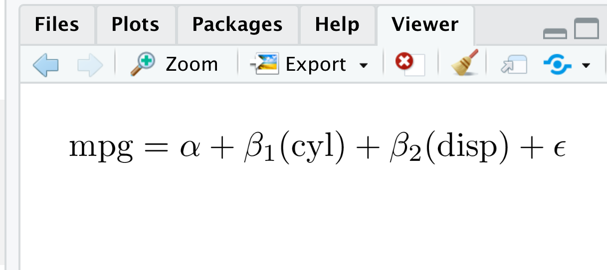

<!-- README.md is generated from README.Rmd. Please edit that file -->

```{r setup, include=FALSE}
library(magrittr)

knitr::opts_chunk$set(
  collapse = TRUE,
  comment = "#>",
  fig.path = "man/figures/README-",
  out.width = "100%"
)

library(texPreview)

tex_opts$set(
  density = 600  # High resolution LaTeX output
)

# Include HTML images when knitting with github_document
if (isTRUE(getOption('knitr.in.progress'))) {
  tex_opts$set(
    returnType = "html"
  )
} 

# Don't use Helvetica in examples
# This could go in tex_opts$set, but it doesn't seem to actually get used there
usrPackages <- "\\renewcommand*\\familydefault{\\rmdefault}"
```

# equatiomatic 

<!-- badges: start -->
[](https://www.tidyverse.org/lifecycle/#maturing)

[](https://tinyurl.com/y43gpto4)
<!-- [](https://codecov.io/gh/datalorax/equatiomatic) -->
[](https://github.com/datalorax/equatiomatic/actions)
[](https://codecov.io/gh/datalorax/equatiomatic?branch=master)
<!-- badges: end -->

The goal of **equatiomatic** is to reduce the pain associated with writing LaTeX
code from a fitted model. In the future, the package aims to support any model
supported by [**broom**](https://cran.r-project.org/package=broom). See the [introduction to equatiomatic](https://datalorax.github.io/equatiomatic/articles/intro-equatiomatic.html#other-models-1) for currently supported models. 

## Installation

equatiomatic is not yet on CRAN. Install the development version from GitHub with

```{r install-command, eval=FALSE}
remotes::install_github("datalorax/equatiomatic")
```


## Basic usage


The gif above shows the basic functionality. 

To convert a model to LaTeX, feed a model object to `extract_eq()`:

```{r example-basic, warning=FALSE, message=FALSE}
library(equatiomatic)

# Fit a simple model
mod1 <- lm(mpg ~ cyl + disp, mtcars)

# Give the results to extract_eq
extract_eq(mod1)
```

```{r example-basic-preview, echo=FALSE}
extract_eq(mod1) %>% 
  tex_preview(usrPackages = usrPackages)
```

The model can be built in any standard way—it can handle shortcut syntax: 

```{r example-shortcut}
mod2 <- lm(mpg ~ ., mtcars)
extract_eq(mod2)
```

```{r example-shortcut-preview, echo=FALSE}
extract_eq(mod2) %>% 
  tex_preview(usrPackages = usrPackages)
```

When using categorical variables, it will include the levels of the variables as subscripts. Here, we use data from the [{palmerpenguins}](https://allisonhorst.github.io/palmerpenguins/index.html) dataset.

```{r example-categorical}
mod3 <- lm(body_mass_g ~ bill_length_mm + species, penguins)
extract_eq(mod3)
```

```{r example-categorical-preview, echo=FALSE}
extract_eq(mod3) %>% 
  tex_preview(usrPackages = usrPackages)
```

It helpfully preserves the order the variables are supplied in the formula:

```{r example-preserve-order}
set.seed(8675309)
d <- data.frame(cat1 = rep(letters[1:3], 100),
                cat2 = rep(LETTERS[1:3], each = 100),
                cont1 = rnorm(300, 100, 1),
                cont2 = rnorm(300, 50, 5),
                out   = rnorm(300, 10, 0.5))
mod4 <- lm(out ~ cont1 + cat2 + cont2 + cat1, d)
extract_eq(mod4)
```

```{r example-preserve-order-preview, echo=FALSE}
extract_eq(mod4) %>% 
  tex_preview(usrPackages = usrPackages)
```

## Appearance

You can wrap the equations so that a specified number of terms appear on the right-hand side of the equation using `terms_per_line` (defaults to 4):

```{r example-wrap}
extract_eq(mod2, wrap = TRUE)
```

```{r example-wrap-preview, echo=FALSE}
extract_eq(mod2, wrap = TRUE) %>% 
  tex_preview(usrPackages = usrPackages)
```

```{r example-wrap-longer}
extract_eq(mod2, wrap = TRUE, terms_per_line = 6)
```

```{r example-wrap-longer-preview, echo=FALSE}
extract_eq(mod2, wrap = TRUE, terms_per_line = 6) %>% 
  tex_preview(usrPackages = usrPackages)
```

When wrapping, you can change whether the lines end with trailing math operators like `+` (the default), or if they should begin with them using `operator_location = "end"` or `operator_location = "start"`:

```{r example-wrap-longer-location}
extract_eq(mod2, wrap = TRUE, terms_per_line = 4, operator_location = "start")
```

```{r example-wrap-longer-location-preview, echo=FALSE}
extract_eq(mod2, wrap = TRUE, terms_per_line = 4, operator_location = "start") %>% 
  tex_preview(usrPackages = usrPackages)
```

By default, all text in the equation is wrapped in `\operatorname{}`. You can optionally have the variables themselves be italicized (i.e. not be wrapped in `\operatorname{}`) with `ital_vars = TRUE`:

```{r example-italics}
extract_eq(mod2, wrap = TRUE, ital_vars = TRUE)
```

```{r example-italics-preview, echo=FALSE}
extract_eq(mod4, wrap = TRUE, ital_vars = TRUE) %>% 
  tex_preview(usrPackages = usrPackages)
```


## R Markdown and previewing

If you include `extract_eq()` in an R Markdown chunk with `results="asis"`, **knitr** will render the equation.

Alternatively, you can run the code interactively, copy/paste the equation to where you want it in your document, and make any edits you'd like. 

You can use the `tex_preview()` function from the [**texPreview**](https://cran.r-project.org/package=texPreview) package to preview the equation in RStudio:

```{r example-preview, eval=FALSE}
tex_preview(extract_eq(mod1))
```



Both `extract_eq()` and `tex_preview()` work with **magrittr** pipes, so you can do something like this:

```{r pipe-example, eval=FALSE}
library(magrittr)  # or library(tidyverse) or any other package that exports %>%

extract_eq(mod1) %>% 
  tex_preview()
```


## Extra options

There are several extra options you can enable with additional arguments to `extract_eq()`

### Actual coefficients

You can return actual numeric coefficients instead of Greek letters with `use_coefs = TRUE`:

```{r use-coefs}
extract_eq(mod1, use_coefs = TRUE)
```

```{r use-coefs-preview, echo=FALSE}
extract_eq(mod1, use_coefs = TRUE) %>% 
  tex_preview(usrPackages = usrPackages)
```

By default, it will remove doubled operators like "+ -", but you can keep those in (which is often useful for teaching) with `fix_signs = FALSE`:

```{r fix-signs}
extract_eq(mod1, use_coefs = TRUE, fix_signs = FALSE)
```

```{r fix-signs-preview, echo=FALSE}
extract_eq(mod1, use_coefs = TRUE, fix_signs = FALSE) %>% 
  tex_preview(usrPackages = usrPackages)
```

This works in longer wrapped equations:

```{r fix-signs-long}
extract_eq(mod2, wrap = TRUE, terms_per_line = 3,
           use_coefs = TRUE, fix_signs = FALSE)
```

```{r fix-signs-long-preview, echo=FALSE}
extract_eq(mod2, wrap = TRUE, terms_per_line = 3, 
           use_coefs = TRUE, fix_signs = FALSE) %>% 
  tex_preview(usrPackages = usrPackages)
```


## Beyond `lm()`

You're not limited to just `lm` models! **equatiomatic** supports many other models, including logistic regression, probit regression, and ordered logistic regression (with `MASS::polr()`).

### Logistic regression with `glm()`

```{r example-logit}
library(palmerpenguins)

model_logit <- glm(sex ~ bill_length_mm + species, 
                   data = penguins, family = binomial(link = "logit"))
extract_eq(model_logit, wrap = TRUE, terms_per_line = 3)
```

```{r example-logit-preview, echo=FALSE}
extract_eq(model_logit, wrap = TRUE, terms_per_line = 3) %>% 
  tex_preview(usrPackages = usrPackages)
```

### Probit regression with `glm()`

```{r example-probit}
model_probit <- glm(sex ~ bill_length_mm + species, 
                    data = penguins, family = binomial(link = "probit"))
extract_eq(model_probit, wrap = TRUE, terms_per_line = 3)
```

```{r example-probit-preview, echo=FALSE}
extract_eq(model_probit, wrap = TRUE, terms_per_line = 3) %>% 
  tex_preview(usrPackages = usrPackages)
```

### Ordered logistic regression with `MASS::polr()`

```{r example-polr}
set.seed(1234)
df <- data.frame(outcome = factor(rep(LETTERS[1:3], 100),
                                  levels = LETTERS[1:3],
                                  ordered = TRUE),
                 continuous_1 = rnorm(300, 100, 1),
                 continuous_2 = rnorm(300, 50, 5))

model_ologit <- MASS::polr(outcome ~ continuous_1 + continuous_2, 
                           data = df, Hess = TRUE, method = "logistic")
model_oprobit <- MASS::polr(outcome ~ continuous_1 + continuous_2, 
                            data = df, Hess = TRUE, method = "probit")

extract_eq(model_ologit, wrap = TRUE)
```

```{r example-ologit-preview, echo=FALSE}
extract_eq(model_ologit, wrap = TRUE) %>% 
  tex_preview(usrPackages = usrPackages)
```

```{r example-polr-probit}
extract_eq(model_oprobit, wrap = TRUE)
```

```{r example-polr-probit-preview, echo=FALSE}
extract_eq(model_oprobit, wrap = TRUE) %>% 
  tex_preview(usrPackages = usrPackages)
```


### Ordered regression (logit and probit) with `ordinal::clm()`

```{r example-clm}
set.seed(1234)
df <- data.frame(outcome = factor(rep(LETTERS[1:3], 100),
                                  levels = LETTERS[1:3],
                                  ordered = TRUE),
                 continuous_1 = rnorm(300, 1, 1),
                 continuous_2 = rnorm(300, 5, 5))

model_ologit <- ordinal::clm(outcome ~ continuous_1 + continuous_2, 
                             data = df, link = "logit")
model_oprobit <- ordinal::clm(outcome ~ continuous_1 + continuous_2, 
                              data = df, link = "probit")

extract_eq(model_ologit, wrap = TRUE)
```

```{r example-clm-ologit-preview, echo=FALSE}
extract_eq(model_ologit, wrap = TRUE) %>% 
  tex_preview(usrPackages = usrPackages)
```

```{r example-clm-probit}
extract_eq(model_oprobit, wrap = TRUE)
```

```{r example-clm-oprobit-preview, echo=FALSE}
extract_eq(model_oprobit, wrap = TRUE) %>% 
  tex_preview(usrPackages = usrPackages)
```


## Extension

This project is brand new. If you would like to contribute, we'd love your help!
We are particularly interested in extending to more models. We hope to support
any model supported by [**broom**](https://cran.r-project.org/package=broom) in
the future.


## Code of Conduct

Please note that the 'equatiomatic' project is released with a
[Contributor Code of Conduct](https://github.com/datalorax/equatiomatic/blob/master/CODE_OF_CONDUCT.md).
By contributing to this project, you agree to abide by its terms.

## A note of appreciation
We'd like to thank the authors of the [{palmerpenguin}](https://allisonhorst.github.io/palmerpenguins/index.html) dataset for generously allowing us to incorporate the `penguins` dataset in our package for example usage.

Horst AM, Hill AP, Gorman KB (2020). *palmerpenguins: Palmer Archipelago (Antarctica) penguin data*. R package version 0.1.0. https://allisonhorst.github.io/palmerpenguins/
