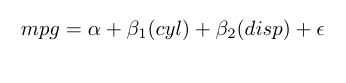

<!-- README.md is generated from README.Rmd. Please edit that file -->

# equatiomatic 

<!-- badges: start -->

[](https://travis-ci.org/datalorax/equatiomatic)
<!-- badges: end -->

The goal of equatiomatic is to reduce the pain associated with writing
LaTex code from a fitted model. At present, only `lm` models are
handled, but the hope is to expand to a greater number of models in the
future.

## Installation

equatiomatic is not yet on CRAN. Install the dev version from GitHub
with

``` r
remotes::install_github("datalorax/equatiomatic")
```

## Examples


The gif above shows the basic functionality.

In non-gif form:

``` r
library(equatiomatic)

# Fit a simple model
mod1 <- lm(mpg ~ cyl + disp, mtcars)

# Give the results to extract_eq_lm
extract_eq_lm(mod1)
#> $$
#>  mpg = \alpha + \beta_{1}(cyl) + \beta_{2}(disp) + \epsilon 
#> $$
```

Including the above in an R Markdown document with `results = "asis"`
will render the equation to look like the below.


Alternatively, you can run the code interactively, copy/paste the
equation to where you want it in your doc, and make any edits you’d
like. There is also the optional `preview` argument that will allow you
to see what the equations look like before you have them rendered.

``` r
extract_eq_lm(mod1, preview = TRUE)
```



It can also handle shortcut syntax.

``` r
mod2 <- lm(mpg ~ ., mtcars)
extract_eq_lm(mod2)
#> $$
#>  mpg = \alpha + \beta_{1}(cyl) + \beta_{2}(disp) + \beta_{3}(hp) + \beta_{4}(drat) + \beta_{5}(wt) + \beta_{6}(qsec) + \beta_{7}(vs) + \beta_{8}(am) + \beta_{9}(gear) + \beta_{10}(carb) + \epsilon 
#> $$
```


For categorical variables, it will place the levels of the variables as
subscripts.

``` r
mod3 <- lm(Sepal.Length ~ Sepal.Width + Species, iris)
extract_eq_lm(mod3)
#> $$
#>  Sepal.Length = \alpha + \beta_{1}(Sepal.Width) + \beta_{2}(Species_{versicolor}) + \beta_{3}(Species_{virginica}) + \epsilon 
#> $$
```


It preserves the order the variables are supplied in the formula.

``` r
set.seed(8675309)
d <- data.frame(cat1 = rep(letters[1:3], 100),
               cat2 = rep(LETTERS[1:3], each = 100),
               cont1 = rnorm(300, 100, 1),
               cont2 = rnorm(300, 50, 5),
               out   = rnorm(300, 10, 0.5))
mod4 <- lm(out ~ cont1 + cat2 + cont2 + cat1, d)
extract_eq_lm(mod4)
#> $$
#>  out = \alpha + \beta_{1}(cont1) + \beta_{2}(cat2_{B}) + \beta_{3}(cat2_{C}) + \beta_{4}(cont2) + \beta_{5}(cat1_{b}) + \beta_{6}(cat1_{c}) + \epsilon 
#> $$
```


You can wrap the equations at a specified width, which defaults to 80.

``` r
extract_eq_lm(mod4, aligned = TRUE)
#> $$
#> \begin{aligned}
#> out =& \alpha + \beta_{1}(cont1) + \beta_{2}(cat2_{B}) + \beta_{3}(cat2_{C}) + \\
#> & \beta_{4}(cont2) + \beta_{5}(cat1_{b}) + \beta_{6}(cat1_{c}) + \epsilon
#> \end{aligned}
#> $$
```


And you can optionally have the variables themselves be non-italicized.

``` r
extract_eq_lm(mod4, aligned = TRUE, width = 100, use_text = TRUE)
#> $$
#> \begin{aligned}
#> \text{out} =& \alpha + \beta_{1}(\text{cont1}) + \beta_{2}(\text{cat2}_{\text{B}}) + \\
#> & \beta_{3}(\text{cat2}_{\text{C}}) + \beta_{4}(\text{cont2}) + \beta_{5}(\text{cat1}_{\text{b}}) + \\
#> & \beta_{6}(\text{cat1}_{\text{c}}) + \epsilon
#> \end{aligned}
#> $$
```


## Extension

This project is brand new. If you would like to contribute, we’d love
your help\! We are particularly interested in extending to more models.
At present, we have only implemented `lm`, but hope to change that in
the near future. Stay tuned\!

## Code of Conduct

Please note that the ‘equatiomatic’ project is released with a
[Contributor Code of Conduct](CODE_OF_CONDUCT.md). By contributing to
this project, you agree to abide by its terms.
