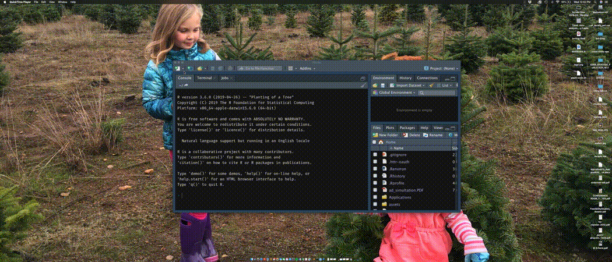
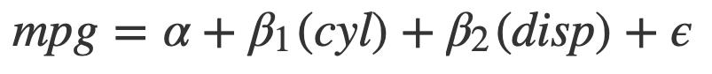
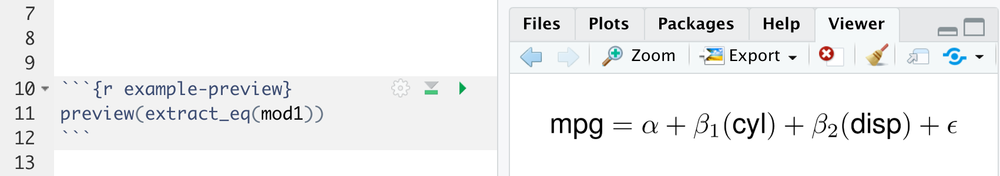
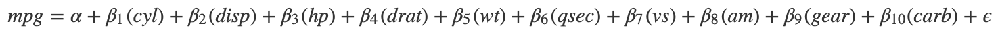
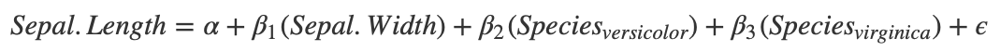
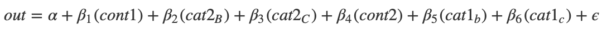
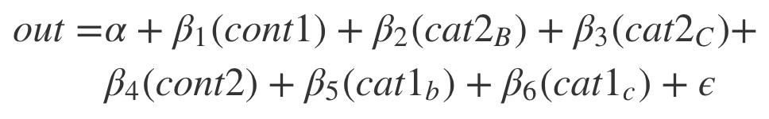
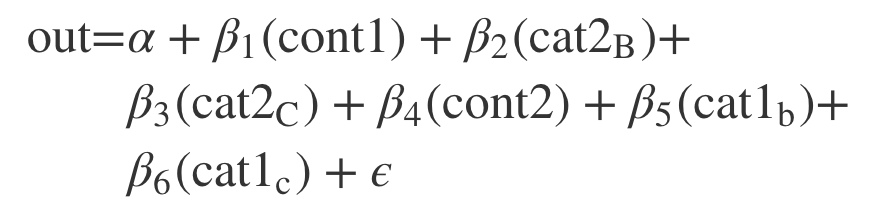
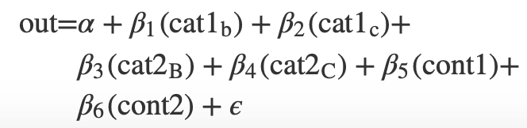
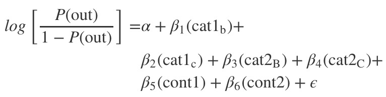

<!-- README.md is generated from README.Rmd. Please edit that file -->

# equatiomatic 

<!-- badges: start -->

[](https://travis-ci.org/datalorax/equatiomatic)
[](https://www.tidyverse.org/lifecycle/#experimental)
[](http://tinyurl.com/y5p5nn2m)
<!-- badges: end -->

The goal of **equatiomatic** is to reduce the pain associated with
writing LaTeX code from a fitted model. In the future, the package will
support any model supported by
[**broom**](https://cran.r-project.org/package=broom); so far it has
only been tested with `lm` and `glm` models.

## Installation

equatiomatic is not yet on CRAN. Install the dev version from GitHub
with

``` r
remotes::install_github("datalorax/equatiomatic")
```

## Examples



The gif above shows the basic functionality.

In non-gif form:

``` r
library(equatiomatic)

# Fit a simple model
mod1 <- lm(mpg ~ cyl + disp, mtcars)

# Give the results to extract_eq
extract_eq(mod1)
#> $$
#>  \text{mpg} = \alpha + \beta_{1} (\text{cyl}) + \beta_{2} (\text{disp}) + \epsilon 
#> $$
```

Including the above in an R Markdown document with `results = "asis"`
will render the equation to look like the below.



Alternatively, you can run the code interactively, copy/paste the
equation to where you want it in your doc, and make any edits you’d
like. There is also the optional `preview` argument that will allow you
to see what the equations look like before you have them rendered.

``` r
extract_eq(mod1, preview = TRUE)
```

and it will show up in your RStudio view pane like below.



You can also request it return the actual coefficients

``` r
extract_eq(mod1, use_coefs = TRUE)
#> $$
#>  \text{mpg} = 34.66 + -1.59 (\text{cyl}) + -0.02 (\text{disp}) + \epsilon 
#> $$
```



It can also handle shortcut syntax.

``` r
mod2 <- lm(mpg ~ ., mtcars)
extract_eq(mod2)
#> $$
#>  \text{mpg} = \alpha + \beta_{1} (\text{cyl}) + \beta_{2} (\text{disp}) + \beta_{3} (\text{hp}) + \beta_{4} (\text{drat}) + \beta_{5} (\text{wt}) + \beta_{6} (\text{qsec}) + \beta_{7} (\text{vs}) + \beta_{8} (\text{am}) + \beta_{9} (\text{gear}) + \beta_{10} (\text{carb}) + \epsilon 
#> $$
```



For categorical variables, it will place the levels of the variables as
subscripts.

``` r
mod3 <- lm(Sepal.Length ~ Sepal.Width + Species, iris)
extract_eq(mod3)
#> $$
#>  \text{Sepal.Length} = \alpha + \beta_{1} (\text{Sepal.Width}) + \beta_{2} (\text{Species}_{\text{versicolor}}) + \beta_{3} (\text{Species}_{\text{virginica}}) + \epsilon 
#> $$
```



It preserves the order the variables are supplied in the formula.

``` r
set.seed(8675309)
d <- data.frame(cat1 = rep(letters[1:3], 100),
               cat2 = rep(LETTERS[1:3], each = 100),
               cont1 = rnorm(300, 100, 1),
               cont2 = rnorm(300, 50, 5),
               out   = rnorm(300, 10, 0.5))
mod4 <- lm(out ~ cont1 + cat2 + cont2 + cat1, d)
extract_eq(mod4)
#> $$
#>  \text{out} = \alpha + \beta_{1} (\text{cont1}) + \beta_{2} (\text{cat2}_{\text{B}}) + \beta_{3} (\text{cat2}_{\text{C}}) + \beta_{4} (\text{cont2}) + \beta_{5} (\text{cat1}_{\text{b}}) + \beta_{6} (\text{cat1}_{\text{c}}) + \epsilon 
#> $$
```



You can wrap the equations at a specified width, which defaults to 80.

``` r
extract_eq(mod4, wrap = TRUE)
#> $$
#> \begin{aligned}
#> \text{out} =& \alpha + \beta_{1} (\text{cont1}) + \beta_{2} (\text{cat2}_{\text{B}}) + \beta_{3} \\
#> & (\text{cat2}_{\text{C}}) + \beta_{4} (\text{cont2}) + \beta_{5} (\text{cat1}_{\text{b}}) + \beta_{6} \\
#> & (\text{cat1}_{\text{c}}) + \epsilon
#> \end{aligned}
#> $$
```



And you can optionally have the variables themselves be italicized.

``` r
extract_eq(mod4, wrap = TRUE, width = 100, ital_vars = TRUE)
#> $$
#> \begin{aligned}
#> out =& \alpha + \beta_{1} (cont1) + \beta_{2} (cat2_{B}) + \beta_{3} (cat2_{C}) + \beta_{4} (cont2) \\
#> & + \beta_{5} (cat1_{b}) + \beta_{6} (cat1_{c}) + \epsilon
#> \end{aligned}
#> $$
```



You’re not limited to just `lm` models\! You should be able to use any
model supported by
[**broom**](https://cran.r-project.org/package=broom), like logistic
regression with `glm()`:

``` r
set.seed(8675309)
d <- data.frame(out = sample(0:1, 100, replace = TRUE),
                cat1 = rep(letters[1:3], 100),
                cat2 = rep(LETTERS[1:3], each = 100),
                cont1 = rnorm(300, 100, 1),
                cont2 = rnorm(300, 50, 5))
mod5 <- glm(out ~ ., data = d, family = binomial(link = "logit"))
extract_eq(mod5, wrap = TRUE)
#> $$
#> \begin{aligned}
#> \text{out} =& \alpha + \beta_{1} (\text{cat1}_{\text{b}}) + \beta_{2} (\text{cat1}_{\text{c}}) + \beta_{3} \\
#> & (\text{cat2}_{\text{B}}) + \beta_{4} (\text{cat2}_{\text{C}}) + \beta_{5} (\text{cont1}) + \beta_{6} (\text{cont2}) + \\
#> & \epsilon
#> \end{aligned}
#> $$
```



## Extension

This project is brand new. If you would like to contribute, we’d love
your help\! We are particularly interested in extending to more models.
At present, we have only tested `lm` and `glm`, but hope to support any
model supported by [**broom**](https://cran.r-project.org/package=broom)
in the future.

## Code of Conduct

Please note that the ‘equatiomatic’ project is released with a
[Contributor Code of Conduct](CODE_OF_CONDUCT.md). By contributing to
this project, you agree to abide by its terms.
