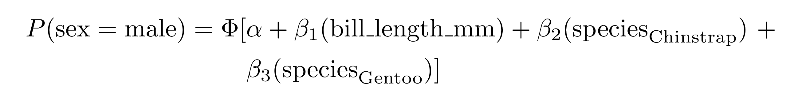
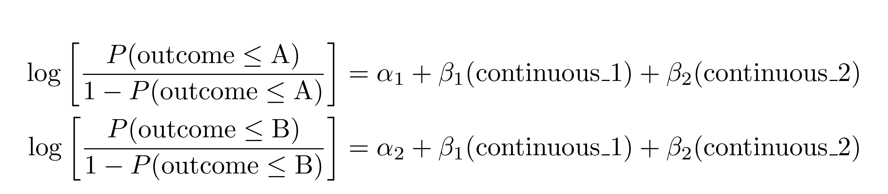
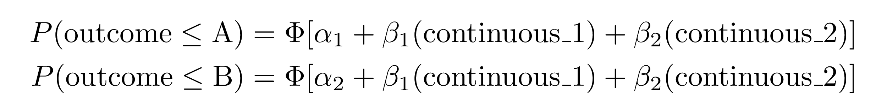

<!-- README.md is generated from README.Rmd. Please edit that file -->

# equatiomatic 

<!-- badges: start -->

[](https://lifecycle.r-lib.org/articles/stages.html#maturing)

[](https://tinyurl.com/y43gpto4)
<!-- [](https://codecov.io/gh/datalorax/equatiomatic) -->

[](https://github.com/datalorax/equatiomatic/actions)

[](https://app.codecov.io/gh/datalorax/equatiomatic?branch=master)

[](https://cranlogs.r-pkg.org/badges/grand-total/equatiomatic)

<!-- badges: end -->

The goal of **equatiomatic** is to reduce the pain associated with
writing LaTeX code from a fitted model. In the future, the package aims
to support any model supported by
[**broom**](https://cran.r-project.org/package=broom). See the
[introduction to
equatiomatic](https://datalorax.github.io/equatiomatic/articles/intro-equatiomatic.html#other-models-1)
for currently supported models.

## Installation

Install from CRAN with

``` r
install.packages("equatiomatic")
```

Or get the development version from GitHub with

``` r
remotes::install_github("datalorax/equatiomatic")
```

## Basic usage


The gif above shows the basic functionality.

To convert a model to LaTeX, feed a model object to `extract_eq()`:

``` r
library(equatiomatic)

# Fit a simple model
mod1 <- lm(mpg ~ cyl + disp, mtcars)

# Give the results to extract_eq
extract_eq(mod1) 
```

    #> $$
    #> \operatorname{mpg} = \alpha + \beta_{1}(\operatorname{cyl}) + \beta_{2}(\operatorname{disp}) + \epsilon
    #> $$


The model can be built in any standard way—it can handle shortcut
syntax:

``` r
mod2 <- lm(mpg ~ ., mtcars)
extract_eq(mod2)
```

    #> $$
    #> \operatorname{mpg} = \alpha + \beta_{1}(\operatorname{cyl}) + \beta_{2}(\operatorname{disp}) + \beta_{3}(\operatorname{hp}) + \beta_{4}(\operatorname{drat}) + \beta_{5}(\operatorname{wt}) + \beta_{6}(\operatorname{qsec}) + \beta_{7}(\operatorname{vs}) + \beta_{8}(\operatorname{am}) + \beta_{9}(\operatorname{gear}) + \beta_{10}(\operatorname{carb}) + \epsilon
    #> $$


When using categorical variables, it will include the levels of the
variables as subscripts. Here, we use data from the
[{palmerpenguins}](https://allisonhorst.github.io/palmerpenguins/index.html)
dataset.

``` r
mod3 <- lm(body_mass_g ~ bill_length_mm + species, penguins)
extract_eq(mod3)
```

    #> $$
    #> \operatorname{body\_mass\_g} = \alpha + \beta_{1}(\operatorname{bill\_length\_mm}) + \beta_{2}(\operatorname{species}_{\operatorname{Chinstrap}}) + \beta_{3}(\operatorname{species}_{\operatorname{Gentoo}}) + \epsilon
    #> $$


It helpfully preserves the order the variables are supplied in the
formula:

``` r
set.seed(8675309)
d <- data.frame(cat1 = rep(letters[1:3], 100),
                cat2 = rep(LETTERS[1:3], each = 100),
                cont1 = rnorm(300, 100, 1),
                cont2 = rnorm(300, 50, 5),
                out   = rnorm(300, 10, 0.5))
mod4 <- lm(out ~ cont1 + cat2 + cont2 + cat1, d)
extract_eq(mod4)
```

    #> $$
    #> \operatorname{out} = \alpha + \beta_{1}(\operatorname{cont1}) + \beta_{2}(\operatorname{cat2}_{\operatorname{B}}) + \beta_{3}(\operatorname{cat2}_{\operatorname{C}}) + \beta_{4}(\operatorname{cont2}) + \beta_{5}(\operatorname{cat1}_{\operatorname{b}}) + \beta_{6}(\operatorname{cat1}_{\operatorname{c}}) + \epsilon
    #> $$


## Appearance

You can wrap the equations so that a specified number of terms appear on
the right-hand side of the equation using `terms_per_line` (defaults to
4):

``` r
extract_eq(mod2, wrap = TRUE)
```

    #> $$
    #> \begin{aligned}
    #> \operatorname{mpg} &= \alpha + \beta_{1}(\operatorname{cyl}) + \beta_{2}(\operatorname{disp}) + \beta_{3}(\operatorname{hp})\ + \\
    #> &\quad \beta_{4}(\operatorname{drat}) + \beta_{5}(\operatorname{wt}) + \beta_{6}(\operatorname{qsec}) + \beta_{7}(\operatorname{vs})\ + \\
    #> &\quad \beta_{8}(\operatorname{am}) + \beta_{9}(\operatorname{gear}) + \beta_{10}(\operatorname{carb}) + \epsilon
    #> \end{aligned}
    #> $$


``` r
extract_eq(mod2, wrap = TRUE, terms_per_line = 6)
```

    #> $$
    #> \begin{aligned}
    #> \operatorname{mpg} &= \alpha + \beta_{1}(\operatorname{cyl}) + \beta_{2}(\operatorname{disp}) + \beta_{3}(\operatorname{hp}) + \beta_{4}(\operatorname{drat}) + \beta_{5}(\operatorname{wt})\ + \\
    #> &\quad \beta_{6}(\operatorname{qsec}) + \beta_{7}(\operatorname{vs}) + \beta_{8}(\operatorname{am}) + \beta_{9}(\operatorname{gear}) + \beta_{10}(\operatorname{carb}) + \epsilon
    #> \end{aligned}
    #> $$


When wrapping, you can change whether the lines end with trailing math
operators like `+` (the default), or if they should begin with them
using `operator_location = "end"` or `operator_location = "start"`:

``` r
extract_eq(mod2, wrap = TRUE, terms_per_line = 4, operator_location = "start")
```

    #> $$
    #> \begin{aligned}
    #> \operatorname{mpg} &= \alpha + \beta_{1}(\operatorname{cyl}) + \beta_{2}(\operatorname{disp}) + \beta_{3}(\operatorname{hp})\\
    #> &\quad + \beta_{4}(\operatorname{drat}) + \beta_{5}(\operatorname{wt}) + \beta_{6}(\operatorname{qsec}) + \beta_{7}(\operatorname{vs})\\
    #> &\quad + \beta_{8}(\operatorname{am}) + \beta_{9}(\operatorname{gear}) + \beta_{10}(\operatorname{carb}) + \epsilon
    #> \end{aligned}
    #> $$


By default, all text in the equation is wrapped in `\operatorname{}`.
You can optionally have the variables themselves be italicized (i.e. not
be wrapped in `\operatorname{}`) with `ital_vars = TRUE`:

``` r
extract_eq(mod2, wrap = TRUE, ital_vars = TRUE)
```

    #> $$
    #> \begin{aligned}
    #> mpg &= \alpha + \beta_{1}(cyl) + \beta_{2}(disp) + \beta_{3}(hp)\ + \\
    #> &\quad \beta_{4}(drat) + \beta_{5}(wt) + \beta_{6}(qsec) + \beta_{7}(vs)\ + \\
    #> &\quad \beta_{8}(am) + \beta_{9}(gear) + \beta_{10}(carb) + \epsilon
    #> \end{aligned}
    #> $$


## R Markdown and previewing

If you include `extract_eq()` in an R Markdown chunk, **knitr** will
render the equation. If you’d like to see the LaTeX code wrap the call
in `print()`.

You can also use the `tex_preview()` function from the
[**texPreview**](https://cran.r-project.org/package=texPreview) package
to preview the equation in RStudio:

``` r
tex_preview(extract_eq(mod1))
```


Both `extract_eq()` and `tex_preview()` work with **magrittr** pipes, so
you can do something like this:

``` r
library(magrittr)  # or library(tidyverse) or any other package that exports %>%

extract_eq(mod1) %>% 
  tex_preview()
```

## Extra options

There are several extra options you can enable with additional arguments
to `extract_eq()`

### Actual coefficients

You can return actual numeric coefficients instead of Greek letters with
`use_coefs = TRUE`:

``` r
extract_eq(mod1, use_coefs = TRUE)
```

    #> $$
    #> \operatorname{\widehat{mpg}} = 34.66 - 1.59(\operatorname{cyl}) - 0.02(\operatorname{disp})
    #> $$


By default, it will remove doubled operators like “+ -”, but you can
keep those in (which is often useful for teaching) with
`fix_signs = FALSE`:

``` r
extract_eq(mod1, use_coefs = TRUE, fix_signs = FALSE)
```

    #> $$
    #> \operatorname{\widehat{mpg}} = 34.66 + -1.59(\operatorname{cyl}) + -0.02(\operatorname{disp})
    #> $$


This works in longer wrapped equations:

``` r
extract_eq(mod2, wrap = TRUE, terms_per_line = 3,
           use_coefs = TRUE, fix_signs = FALSE)
```

    #> $$
    #> \begin{aligned}
    #> \operatorname{\widehat{mpg}} &= 12.3 + -0.11(\operatorname{cyl}) + 0.01(\operatorname{disp})\ + \\
    #> &\quad -0.02(\operatorname{hp}) + 0.79(\operatorname{drat}) + -3.72(\operatorname{wt})\ + \\
    #> &\quad 0.82(\operatorname{qsec}) + 0.32(\operatorname{vs}) + 2.52(\operatorname{am})\ + \\
    #> &\quad 0.66(\operatorname{gear}) + -0.2(\operatorname{carb})
    #> \end{aligned}
    #> $$


## Beyond `lm()`

You’re not limited to just `lm` models! **equatiomatic** supports many
other models, including logistic regression, probit regression, and
ordered logistic regression (with `MASS::polr()`).

### Logistic regression with `glm()`

``` r
model_logit <- glm(sex ~ bill_length_mm + species, 
                   data = penguins, family = binomial(link = "logit"))
extract_eq(model_logit, wrap = TRUE, terms_per_line = 3)
```

    #> $$
    #> \begin{aligned}
    #> \log\left[ \frac { P( \operatorname{sex} = \operatorname{male} ) }{ 1 - P( \operatorname{sex} = \operatorname{male} ) } \right] &= \alpha + \beta_{1}(\operatorname{bill\_length\_mm}) + \beta_{2}(\operatorname{species}_{\operatorname{Chinstrap}})\ + \\
    #> &\quad \beta_{3}(\operatorname{species}_{\operatorname{Gentoo}})
    #> \end{aligned}
    #> $$


### Probit regression with `glm()`

``` r
model_probit <- glm(sex ~ bill_length_mm + species, 
                    data = penguins, family = binomial(link = "probit"))
extract_eq(model_probit, wrap = TRUE, terms_per_line = 3)
```

    #> $$
    #> \begin{aligned}
    #> P( \operatorname{sex} = \operatorname{male} ) &= \Phi[\alpha + \beta_{1}(\operatorname{bill\_length\_mm}) + \beta_{2}(\operatorname{species}_{\operatorname{Chinstrap}})\ + \\
    #> &\qquad\ \beta_{3}(\operatorname{species}_{\operatorname{Gentoo}})]
    #> \end{aligned}
    #> $$



### Ordered logistic regression with `MASS::polr()`

``` r
set.seed(1234)
df <- data.frame(outcome = factor(rep(LETTERS[1:3], 100),
                                  levels = LETTERS[1:3],
                                  ordered = TRUE),
                 continuous_1 = rnorm(300, 100, 1),
                 continuous_2 = rnorm(300, 50, 5))

model_ologit <- MASS::polr(outcome ~ continuous_1 + continuous_2, 
                           data = df, Hess = TRUE, method = "logistic")
model_oprobit <- MASS::polr(outcome ~ continuous_1 + continuous_2, 
                            data = df, Hess = TRUE, method = "probit")

extract_eq(model_ologit, wrap = TRUE)
```

    #> $$
    #> \begin{aligned}
    #> \log\left[ \frac { P( \operatorname{A} \geq \operatorname{B} ) }{ 1 - P( \operatorname{A} \geq \operatorname{B} ) } \right] &= \alpha_{1} + \beta_{1}(\operatorname{continuous\_1}) + \beta_{2}(\operatorname{continuous\_2}) \\
    #> \log\left[ \frac { P( \operatorname{B} \geq \operatorname{C} ) }{ 1 - P( \operatorname{B} \geq \operatorname{C} ) } \right] &= \alpha_{2} + \beta_{1}(\operatorname{continuous\_1}) + \beta_{2}(\operatorname{continuous\_2})
    #> \end{aligned}
    #> $$



``` r
extract_eq(model_oprobit, wrap = TRUE)
```

    #> $$
    #> \begin{aligned}
    #> P( \operatorname{A} \geq \operatorname{B} ) &= \Phi[\alpha_{1} + \beta_{1}(\operatorname{continuous\_1}) + \beta_{2}(\operatorname{continuous\_2})] \\
    #> P( \operatorname{B} \geq \operatorname{C} ) &= \Phi[\alpha_{2} + \beta_{1}(\operatorname{continuous\_1}) + \beta_{2}(\operatorname{continuous\_2})]
    #> \end{aligned}
    #> $$



### Ordered regression (logit and probit) with `ordinal::clm()`

``` r
set.seed(1234)
df <- data.frame(outcome = factor(rep(LETTERS[1:3], 100),
                                  levels = LETTERS[1:3],
                                  ordered = TRUE),
                 continuous_1 = rnorm(300, 1, 1),
                 continuous_2 = rnorm(300, 5, 5))

model_ologit <- ordinal::clm(outcome ~ continuous_1 + continuous_2, 
                             data = df, link = "logit")
model_oprobit <- ordinal::clm(outcome ~ continuous_1 + continuous_2, 
                              data = df, link = "probit")

extract_eq(model_ologit, wrap = TRUE)
```

    #> $$
    #> \begin{aligned}
    #> \log\left[ \frac { P( \operatorname{A} \geq \operatorname{B} ) }{ 1 - P( \operatorname{A} \geq \operatorname{B} ) } \right] &= \alpha_{1} + \beta_{1}(\operatorname{continuous\_1}) + \beta_{2}(\operatorname{continuous\_2}) \\
    #> \log\left[ \frac { P( \operatorname{B} \geq \operatorname{C} ) }{ 1 - P( \operatorname{B} \geq \operatorname{C} ) } \right] &= \alpha_{2} + \beta_{1}(\operatorname{continuous\_1}) + \beta_{2}(\operatorname{continuous\_2})
    #> \end{aligned}
    #> $$


``` r
extract_eq(model_oprobit, wrap = TRUE)
```

    #> $$
    #> \begin{aligned}
    #> P( \operatorname{A} \geq \operatorname{B} ) &= \Phi[\alpha_{1} + \beta_{1}(\operatorname{continuous\_1}) + \beta_{2}(\operatorname{continuous\_2})] \\
    #> P( \operatorname{B} \geq \operatorname{C} ) &= \Phi[\alpha_{2} + \beta_{1}(\operatorname{continuous\_1}) + \beta_{2}(\operatorname{continuous\_2})]
    #> \end{aligned}
    #> $$


## Extension

This project is brand new. If you would like to contribute, we’d love
your help! We are particularly interested in extending to more models.
We hope to support any model supported by
[**broom**](https://cran.r-project.org/package=broom) in the future.

## Code of Conduct

Please note that the ‘equatiomatic’ project is released with a
[Contributor Code of
Conduct](https://github.com/datalorax/equatiomatic/blob/master/CODE_OF_CONDUCT.md).
By contributing to this project, you agree to abide by its terms.

## A note of appreciation

We’d like to thank the authors of the
[{palmerpenguin}](https://allisonhorst.github.io/palmerpenguins/index.html)
dataset for generously allowing us to incorporate the `penguins` dataset
in our package for example usage.

Horst AM, Hill AP, Gorman KB (2020). *palmerpenguins: Palmer Archipelago
(Antarctica) penguin data*. R package version 0.1.0.
<https://allisonhorst.github.io/palmerpenguins/>
