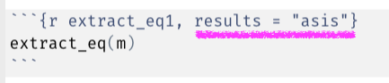

```{r, include = FALSE}
knitr::opts_chunk$set(
  collapse = TRUE,
  comment = "#>",
  results = "asis"
)
```

# Background and Motivation

If you use R to statistically analyze your data, you might be used to seeing and 
interpreting the output from functions for models, like `lm()` and `glm()`. For example,
here is the code and output for a single regression model, fit using the `lm()`
function. We'll examine how the depth of penguin's bills relates to their bill
length using data from the [{palmerpenguins}](https://github.com/allisonhorst/palmerpenguins)
package:

```{r, warning = FALSE, results = 'markup'}
library(palmerpenguins) # data source
lm(bill_length_mm ~ bill_depth_mm, penguins)
```

At the same time, you might have come across---or written!---equations that
appear in books, journal articles, and reports. Equations that look like this:

```{r, echo = FALSE, results = "asis"}
library(equatiomatic)
extract_eq(lm(bill_length_mm ~ bill_depth_mm, penguins))
```

The purpose of the [{equatiomatic}](https://datalorax.github.io/equatiomatic/) 
package is to help you to get from model output, like the `lm()` output above,
and the equation we just saw. 

As we detail in this vignette, {equatiomatic} provides the underlying equation
corresponding to the statistical model you fit. It does this through the use of
the [TeX](https://en.wikipedia.org/wiki/TeX) equation formatting system, which
can then be included in documents written in a number of formats, including 
(importantly) RMarkdown documents.

# Back Example

Let's look at another basic example, again using the {palmerpenguins} data:

```{r fit-m1}
library(equatiomatic)

# fit a basic multiple linear regression model
m <- lm(bill_length_mm ~ bill_depth_mm + flipper_length_mm, penguins)
```

Now we can pull the tex code with `extract_eq`

```{r extract_eq1, results = 'markup'}
extract_eq(m)
```

This is moderately helpful, but if we set the code chunk to `results = "asis"`, as shown below, we get the actual equation when we knit the R Markdown document!



You can of course set `echo = FALSE` as well, and then you'll get just the equation, which will look like the below.

```{r extract_eq1-no-echo, results = "asis", echo = FALSE}
extract_eq(m)
```

Just as a note, *the equation should render if you are rendering either an HTML or PDF document.*

Let's dive into a more complex example next.

## A bit more complicated model
The above was super simple, but---often---you have categorical variables with lots of
levels and interactions, which can make the output of your models (and writing a 
model equation for your models) a bit more complicated. {equatiomatic} is 
intended to "smooth out" some of these issues, requiring the same process as in 
the above example to extract (and present) the model's equation:

For example, here is an example using a categorical variable (`island`) in an
interaction with the `bill_depth_mm` variable we used in the example above:

```{r eq2}
m2 <- lm(bill_length_mm ~ bill_depth_mm*island, penguins)
extract_eq(m2)
```

Sometimes, for such models, the equations can get overly long. 

That's where the `wrap` and `terms_per_line` arguments come in.

```{r eq2-wrap}
extract_eq(m2, wrap = TRUE) # default terms_per_line = 4
extract_eq(m2, wrap = TRUE, terms_per_line = 2)
```

Maybe you want different intercept notation, such as $\beta_0$? Simply pass
"beta" to the `intercept` argument, as follows. 

```{r eq2-intercept-beta}
extract_eq(m2, wrap = TRUE, intercept = "beta")
```

We also wrap all the variable names in `\operatorname` by default so they show
up as plain text, but if you'd like your variable names to be italicized just
set `ital_vars = TRUE`.

```{r eq2-ital-vars}
extract_eq(m2, wrap = TRUE, ital_vars = TRUE)
```

## Raw tex code

Currently, the `intercept` argument defaults to `"alpha"` and only takes one
additional argument, `"beta"`. However, the `raw_tex` and `greek` arguments
allows you to specify whatever syntax you would like. For example

```{r raw-tex}
extract_eq(m2, 
           wrap = TRUE, 
           intercept = "\\hat{\\gamma_{0}}", 
           greek = "\\hat{\\gamma}",
           raw_tex = TRUE)
```

## Coefficients
In many cases, you're interested more in including the coefficient estimates
(e.g., `3.04`), instead of the Greek symbols (e.g., $\\beta\_1$). This may be
helpful for communicating the results of a model (and, possibly, for teaching 
about statistical modeling). To do this, simply change the `use_coefs` argument:

```{r use_coefs}
extract_eq(m2, 
           wrap = TRUE, 
           use_coefs = TRUE)
```

# Other models

While the above examples focused on regression models (and the `lm()` function), 
{equatiomatic} supports output from other model types, specifically:

```{r echo = FALSE}
supported <- data.frame(
  model = c("linear regression",
            "logistic regression",
            "probit regression",
            "ordinal regression"),
  packages = c("`stats::lm`",
               "`stats::glm`, `family = binomial(link = 'logit')`",
               "`stats::glm`, `family = binomial(link = 'probit')`",
               "`MASS::polr`, `ordinal::clm`")
  )
knitr::kable(supported, col.names = c("Model", "Packages/Functions"))
```

Here are a few basic examples using these supported model types:

## Logistic Regression
```{r log-reg1}
lr <- glm(sex ~ species*bill_length_mm, 
          data = penguins, 
          family = binomial(link = "logit"))

extract_eq(lr)
```

You can also (optionally) show the how the data are assumed to be distributed.

```{r log-reg2}
extract_eq(lr, show_distribution = TRUE)
```

## Probit Regression
Probit regression works similarly to logistic regression:
```{r prob-reg1}
pr <- glm(sex ~ species*bill_length_mm, 
          data = penguins, 
          family = binomial(link = "probit"))

extract_eq(pr, wrap = TRUE)
```

Again, you can (optionally) show the how the data are assumed distributed.

```{r prob-reg2}
extract_eq(pr, show_distribution = TRUE)
```

## Ordinal Regression w/{MASS}

<!-- ADD  -->

```{r}

```

<!-- ADD  -->

## Ordinal Regression w/{ordinal}

```{r}

```

# Things the package does not yet do

We are aware of a few things the package doesn't yet do, but that we hope to add
later. These include:

  - Math functions (e.g., `log`, `exp`, `sqrt`)
  - Polynomial (e.g., `lm(y ~ poly(x, 3))`)
  - A range of other models, including multi-level (or mixed effects) models

Regarding this last point, we are hopeful that we can incorporate essentially
all the models covered by [broom](https://broom.tidymodels.org). Multilevel
models are particularly high on our wish list. But we have not yet had the time
to develop these.

# Contributing

We would LOVE to have you as a contributor! Is there a model that we don't
currently fit that you want implemented? There are a few ways to go about this.
You can either (a) fork the repo and implement the method on your own, then
submit a PR, or (b) file an issue.

If you file an issue it would be *really* helpful if you could provide an
example of a fitted model and what the equation for that model should look like.
We will try to get to these as soon as possible.

Also, the next planned vignette (at this particular moment) is on contributing
to the package, with a step-by-step example of implementing a new method. So
stay tuned for that, if you're interested in (a) but not yet sure how to get
started.
